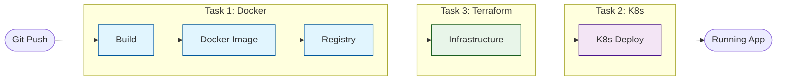

# Technical Assessment Assignment;

> This technical assessment consists of four interconnected tasks that will evaluate your skills in containerization, orchestration, infrastructure as code, and automation;

## Prerequisites;

- Docker installed locally;
- Kubernetes cluster (local, like minikube or kind);
- Terraform installed;
- Basic shell scripting knowledge;
- Git;

## Tasks;

### Task 1: Dockerization;
**Directory**: [`dockerize`](dockerize);
- Containerize a pre-written Golang web server;
- No Golang knowledge required;
- Focus on Docker best practices and configuration;

### Task 2: Kubernetes Deployment;
**Directory**: [`kubernetes`](kubernetes);
- Deploy the Docker image from Task 1 to a local Kubernetes cluster;
- Follow the provided specifications in the directory;
- Demonstrate understanding of Kubernetes concepts;

### Task 3: Terraform Module;
**Directory**: [`terraform`](terraform);
- Create a Terraform module for Kubernetes resources;
- Must use the official Kubernetes provider;
- No third-party providers allowed;

### Task 4: Shell Script Automation;
**Directory**: [`linux`](linux);
- Create automation scripts;
- Focus on shell scripting best practices;
- Details provided in the directory;

## Getting Started;

1. Clone this repository;
2. Read the README in each task directory for specific requirements;
3. Complete the tasks in order, as they build upon each other;
4. Follow best practices for each technology used;

## CI/CD Pipeline Overview;

Here's how all tasks connect in a real-world CI/CD pipeline:



### Pipeline Steps in Practice;

1. **Pipeline Start (Git Push)**;
   - Developer pushes code;
   - CI/CD is triggered;
   - Repository checkout;

2. **Build & Test (Task 1)**;
   ```bash
   # Build the image
   docker build -t app:latest .
   
   # Local testing
   docker run -it --rm app:latest
   
   # Push to registry
   docker tag app:latest registry/app:latest
   docker push registry/app:latest
   ```

3. **Infrastructure Setup (Task 3)**;
   ```bash
   # Terraform to create/update infrastructure
   terraform init
   terraform plan
   terraform apply
   
   # Verify cluster state
   kubectl get nodes
   kubectl get namespaces
   ```

4. **Deployment Preparation (Task 4 - Automation)**;
   ```bash
   # The automation script handles:
   # 1. Building new image
   # 2. Generating dynamic tags
   # 3. Updating K8s manifests
   ./automation.sh user repo_name
   
   # Review the changes before applying
   kubectl diff -f new-app.yaml
   ```

5. **Deployment (Task 2)**;
   ```bash
   # Deploy to K8s using the manifest generated by automation.sh
   kubectl apply -f new-app.yaml
   
   # Check status
   kubectl get pods
   kubectl get services
   ```

### Automation Script Usage Scenarios;

1. **During Development**;
   ```bash
   # Local testing cycle
   vim Dockerfile              # Make changes to Dockerfile
   ./automation.sh dev local   # Build and prepare manifests
   kubectl apply -f new-app.yaml # Apply changes
   ```

2. **In CI/CD Pipeline**;
   ```bash
   # CI/CD step example
   - name: Prepare Deployment
     run: |
       # Generate unique tag based on git commit
       TAG=$(git rev-parse --short HEAD)
       
       # Run automation script
       ./automation.sh company-registry $TAG
       
       # Store generated manifest for next steps
       cp new-app.yaml deployment/
   ```

3. **During Release**;
   ```bash
   # Release to production
   ./automation.sh prod-registry release-v1.0
   
   # Review changes
   kubectl diff -f new-app.yaml
   
   # Apply if everything looks good
   kubectl apply -f new-app.yaml
   ```

4. **Rollback Scenario**;
   ```bash
   # Generate rollback manifest
   ./automation.sh registry previous-tag
   
   # Apply rollback
   kubectl apply -f new-app.yaml
   ```

### Manual Usage Scenarios;

The `automation.sh` script is your Swiss Army knife for:

* **Development & Testing**;
  * Local environment setup and testing;
  * Quick iterations and deployments;
  * Feature branch validation;

* **Operations**;
  * Emergency hotfixes;
  * Quick rollbacks;
  * Version management;
  * State verification;

* **Benefits**;
  * Reduces manual errors;
  * Consistent process;
  * Fast recovery options;
  * Easy troubleshooting;

## Notes;

- Check each task's README for details;
- Follow tasks in sequence;
