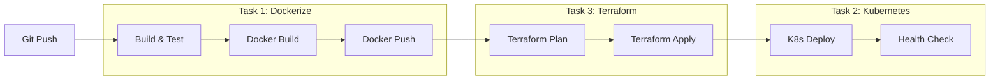

# Technical Assessment Assignment;

> This technical assessment consists of four interconnected tasks that will evaluate your skills in containerization, orchestration, infrastructure as code, and automation;

## Prerequisites;

- Docker installed locally;
- Kubernetes cluster (local, like minikube or kind);
- Terraform installed;
- Basic shell scripting knowledge;
- Git;

## Tasks;

### Task 1: Dockerization;
**Directory**: [`dockerize`](dockerize);
- Containerize a pre-written Golang web server;
- No Golang knowledge required;
- Focus on Docker best practices and configuration;

### Task 2: Kubernetes Deployment;
**Directory**: [`kubernetes`](kubernetes);
- Deploy the Docker image from Task 1 to a local Kubernetes cluster;
- Follow the provided specifications in the directory;
- Demonstrate understanding of Kubernetes concepts;

### Task 3: Terraform Module;
**Directory**: [`terraform`](terraform);
- Create a Terraform module for Kubernetes resources;
- Must use the official Kubernetes provider;
- No third-party providers allowed;

### Task 4: Shell Script Automation;
**Directory**: [`linux`](linux);
- Create automation scripts;
- Focus on shell scripting best practices;
- Details provided in the directory;

## Getting Started;

1. Clone this repository;
2. Read the README in each task directory for specific requirements;
3. Complete the tasks in order, as they build upon each other;
4. Follow best practices for each technology used;

## CI/CD Pipeline Overview;

The tasks in this assessment represent different stages of a complete CI/CD pipeline. Here's how they connect:

### Pipeline Stages;

1. **Build & Test (Task 1)**;
   - Code checkout;
   - Unit testing;
   - Code analysis;
   - Docker image building;

2. **Infrastructure (Task 3)**;
   - Terraform planning;
   - Infrastructure provisioning;
   - K8s cluster preparation;

3. **Deployment (Task 2)**;
   - K8s manifest application;
   - Service deployment;
   - Health verification;

4. **Automation (Task 4)**;
   - The `linux/automation.sh` script ties everything together:;
     - Automated image building and tagging;
     - Dynamic K8s manifest updates;
     - Deployment state verification;
     - Can be used in both local development and CI/CD;

## Submission;

Please follow the submission guidelines provided in each task directory;

## Notes;

- Each task has its own detailed README with specific requirements;
- Tasks are designed to be completed sequentially;
